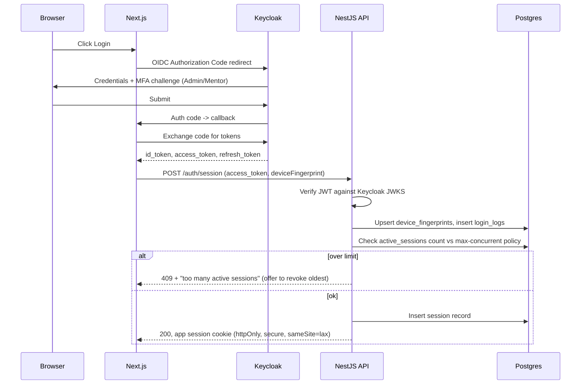
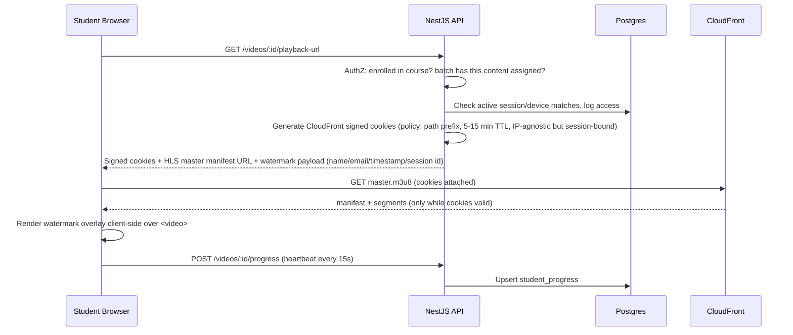

# 1. System Architecture

## 1.1 Architectural style

**Modular monolith (NestJS) behind a Next.js BFF-ish frontend, with clear module boundaries that
map 1:1 to future microservices.** At hundreds–low thousands of students, a well-modularized
monolith is faster to build, easier to operate, and cheaper than microservices, while NestJS's
module system (`@Module`) keeps the seams where a future split would happen (Video, Notification,
Audit are the first candidates to peel off once video processing load or notification volume
justifies independent scaling).

```mermaid
flowchart TB
    subgraph Client
        WEB[Next.js App Router\nStudent / Admin / Mentor Portals]
    end

    subgraph Edge["AWS Edge"]
        CF_WEB[CloudFront - static/app]
        CF_VID[CloudFront - HLS video, signed URLs/cookies]
        WAF[AWS WAF]
    end

    subgraph Core["Core Platform (ECS Fargate)"]
        API[NestJS API\nModules: Auth, Users, Courses, Batches,\nContent, Video, Assignments, Notifications, Audit]
        WORKER[NestJS Worker\n(BullMQ consumers: transcode-callback,\nnotifications, report generation)]
    end

    subgraph IdP["Identity"]
        KC[Keycloak\n(OIDC, MFA, sessions)]
    end

    subgraph Data
        PG[(PostgreSQL\nRDS Multi-AZ)]
        REDIS[(Redis\nElastiCache - cache, queues, rate limits)]
        S3RAW[(S3 - raw uploads)]
        S3PROC[(S3 - processed HLS + docs)]
    end

    subgraph MediaPipe["Video Pipeline"]
        MC[AWS MediaConvert]
        SQS[SQS]
        LAMBDA[Lambda - orchestration]
    end

    subgraph Obs["Observability"]
        PROM[Prometheus]
        GRAF[Grafana]
        LOKI[Loki / CloudWatch Logs]
    end

    WEB -->|HTTPS| WAF --> CF_WEB --> API
    WEB -->|video.m3u8, signed| CF_VID --> S3PROC
    WEB -->|OIDC redirect| KC
    API <--> KC
    API --> PG
    API --> REDIS
    API --> S3RAW
    S3RAW -->|ObjectCreated event| LAMBDA --> MC
    MC --> S3PROC
    MC -->|status| SQS --> WORKER --> PG
    WORKER --> REDIS
    API -.metrics.-> PROM --> GRAF
    API -.logs.-> LOKI
```

## 1.2 Tech stack rationale

| Layer | Choice | Why |
|---|---|---|
| Frontend | Next.js App Router + TS + Tailwind + ShadCN + React Query | SSR/ISR for marketing + course catalog SEO, RSC for fast authenticated dashboards, ShadCN gives accessible primitives without a heavy design-system lock-in, React Query handles server-state caching/invalidation for progress/notifications |
| Backend | NestJS + TS | Opinionated modular structure, first-class DI (testable), built-in Guards/Interceptors map directly onto RBAC + audit logging, mature ecosystem (BullMQ, Passport, class-validator) |
| DB | PostgreSQL (RDS) | Relational integrity for enrollments/permissions, JSONB for flexible per-course metadata, mature replication/PITR story |
| ORM | Prisma | Type-safe queries matching TS end-to-end, first-class migration tooling |
| Cache/Queue | Redis (ElastiCache) + BullMQ | Session/rate-limit store, background jobs (transcode callbacks, notification fan-out, report generation) |
| Object storage | S3 (raw + processed buckets, separate for lifecycle policy control) | Durable, integrates natively with MediaConvert + CloudFront |
| Video | CloudFront + MediaConvert, HLS ABR | Managed transcode, signed URL/cookie support out of the box |
| Monitoring | Prometheus + Grafana | Industry standard, NestJS has `@willsoto/nestjs-prometheus`, self-hostable on ECS or Amazon Managed Service for Prometheus |
| Logging | Structured JSON (pino) → CloudWatch/Loki, separate append-only audit log table | Structured logs for ops, audit log is a compliance-grade, tamper-evident record (see doc 4) |
| IaC/Deploy | Docker + Docker Compose (dev) + ECS Fargate (prod) + GitHub Actions | No k8s operational overhead at this scale; Fargate gives managed scaling without EC2 fleet management |

## 1.3 Authentication: Keycloak (recommended) vs. alternatives

The brief asks to use Keycloak "or recommend a better alternative." Recommendation: **use
Keycloak**, self-hosted on ECS Fargate (or Amazon-managed alternative if it exists in-region),
backed by RDS Postgres, for these reasons specific to this platform's requirements:

| Requirement | Keycloak fit | Alternative considered |
|---|---|---|
| MFA for Admins (TOTP/WebAuthn) | Built-in, no extra integration | Auth.js/NextAuth: no built-in MFA, must hand-roll |
| Concurrent session tracking & revocation (credential-sharing prevention) | Native admin REST API exposes active sessions per user, can revoke by session/device | Home-grown JWT: must build session registry yourself anyway — Keycloak gives it for free |
| RBAC/permission mapping, future SSO for corporate training clients | Realms + client roles + fine-grained authorization services; each future corporate client can be a separate Keycloak **realm** | Clerk/WorkOS: excellent DX but per-MAU pricing becomes expensive at 10k+ students and less control over self-hosted data residency |
| Self-hosted, data residency, cost at 10k users | Free, self-hosted, scales horizontally behind ALB | Managed IdPs (Auth0/Clerk/Cognito) charge per MAU — at 10k+ students this is materially more expensive than a $0-license, self-hosted Keycloak on modest Fargate tasks |
| Audit trail of logins | Keycloak event listener SPI → forward to our own `login_logs`/`audit_logs` tables | n/a |

**Trade-off accepted:** Keycloak adds an operational component (one more service to run, patch,
back up) versus a fully managed IdP. Given the explicit requirements for MFA, concurrent-session
policing, and future multi-tenant corporate SSO, this is worth it. If the team later decides
operational overhead isn't worth it, **AWS Cognito** is the fallback (native AWS IAM/CloudFront
signed-cookie integration is a plus) — call this out during review if preferred.

Integration pattern: Next.js uses Auth.js's Keycloak OIDC provider (or `next-auth`) purely as the
browser-side OIDC client; NestJS validates the resulting JWT (RS256, JWKS from Keycloak) via a
Passport strategy. Our own `users` table stores the FK to Keycloak's `sub` (subject) plus all
LMS-specific profile/role/permission data — Keycloak is the identity source of truth, our DB is
the authorization/business-data source of truth.

## 1.4 Key sequence flows

### Login with MFA + device/session registration



### Secure video playback



## 1.5 Scalability plan (hundreds → 10,000+ students)

- **Stateless API**: NestJS instances behind ALB, horizontal auto-scaling on ECS Fargate by
  CPU/RPS; sessions/rate-limit state in Redis, not memory.
- **DB**: start single RDS instance (Multi-AZ for HA), add read replicas for reporting/analytics
  queries once dashboard load grows; partition high-volume tables (`login_logs`, `audit_logs`,
  `student_progress` heartbeats) by month from day one so pruning/archival is cheap later.
- **Video**: all heavy lifting (transcode, delivery) is already offloaded to managed AWS services
  (MediaConvert, CloudFront, S3) — this is the piece that scales "for free" with usage.
- **Queues**: BullMQ/Redis absorbs bursty work (bulk enrollment, notification fan-out, report
  generation) so API request threads stay fast.
- **Caching**: Redis cache for course catalog, batch rosters, permission lookups (short TTL +
  event-based invalidation on admin writes).
- **Multi-tenancy readiness for corporate training**: schema includes an `organization_id`
  nullable FK on `users`/`enrollments` from day one (see doc 3) so corporate cohorts can be
  scoped without a schema migration later.
