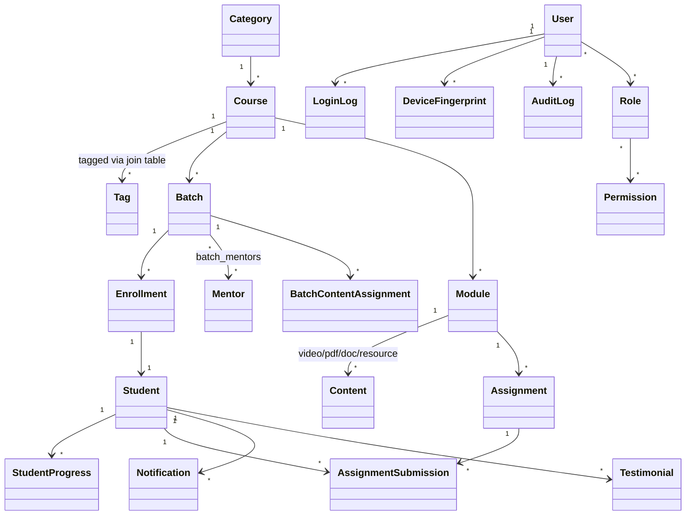

# 2. Domain Model & RBAC

## 2.1 Domain model (conceptual)

Key modeling decisions:

- **Course, Category, Tag, Module, Batch are 100% admin-authorable** — no enum of course names
  anywhere in code. Adding "Prompt Engineering for Product Managers" is a form submission, not a
  deploy.
- **Content is polymorphic** (`type: VIDEO | PDF | DOCUMENT | PRESENTATION | LINK`) and belongs to
  a `Module`; a `BatchContentAssignment` join table controls *which batches* currently have access
  to a piece of content, decoupling "content exists" from "content is released to this cohort" —
  this is how staggered/drip content release works without duplicating content records.
- **Enrollment** is the join between `Student` and `Batch` (not `Course` directly), because access
  control, mentor assignment, and scheduling are all batch-scoped. A student *can* have multiple
  enrollments across batches/courses.
- **Permission is data, not code**: `Role → Permission` is a many-to-many table, so granting a
  Mentor a one-off extra permission doesn't require a code change or new role. Roles are a
  convenience bundle over permissions.

## 2.2 RBAC matrix

Roles are hierarchical for convenience (Super Admin ⊇ Admin ⊇ Mentor/Student scopes don't overlap
except where noted) but enforcement is **permission-based**, checked via a NestJS `PermissionsGuard`
reading the caller's resolved permission set — never a raw `role === 'admin'` string check, so
granular exceptions are possible later without refactoring guards.

| Capability | Super Admin | Admin | Mentor | Student |
|---|:---:|:---:|:---:|:---:|
| Manage Admin accounts (create/suspend/delete) | ✅ | ❌ | ❌ | ❌ |
| Manage Admin/Super Admin role assignment | ✅ | ❌ | ❌ | ❌ |
| System configuration (feature flags, global settings) | ✅ | ❌ | ❌ | ❌ |
| View billing/future revenue metrics | ✅ | ✅ (read-only) | ❌ | ❌ |
| Create/edit/archive/delete Courses | ✅ | ✅ | ❌ | ❌ |
| Configure Categories/Tags | ✅ | ✅ | ❌ | ❌ |
| Create/edit Batches, schedule | ✅ | ✅ | ❌ | ❌ |
| Assign Mentors to Batch/Course | ✅ | ✅ | ❌ | ❌ |
| Assign Students to Batch, transfer batch | ✅ | ✅ | ❌ | ❌ |
| Create/edit/suspend/delete Student accounts | ✅ | ✅ | ❌ | ❌ |
| Reset student passwords | ✅ | ✅ | ❌ | ❌ (self-service via Keycloak "forgot password") |
| Upload/rename/delete/archive Content | ✅ | ✅ | ✅ (own batch's content only, needs `content:upload` perm) | ❌ |
| Assign Content to Batch | ✅ | ✅ | ❌ (proposes; Admin approves) — configurable | ❌ |
| Grade / give feedback on Assignment Submissions | ✅ | ✅ | ✅ (own batch students only) | ❌ |
| Broadcast / batch / individual notifications | ✅ | ✅ | ✅ (own batch only) | ❌ |
| View own batch roster (names, progress) | ✅ | ✅ | ✅ | ❌ |
| View other students' data | ✅ | ✅ | ❌ (own batch only) | ❌ (never) |
| View Login history / device history / IP / audit logs | ✅ | ✅ (scoped to students, not other Admins) | ❌ | ❌ |
| View own login/device history | ✅ | ✅ | ✅ | ✅ |
| Watch assigned videos, download PDFs via viewer | — | — | ✅ (as content owner) | ✅ (assigned content only) |
| Download raw video files | ❌ (nobody — see doc 5) | ❌ | ❌ | ❌ |
| Submit assignments / GitHub links | ❌ | ❌ | ❌ | ✅ |
| Submit testimonials/reviews | ❌ | ❌ | ❌ | ✅ |
| Edit own profile | ✅ | ✅ | ✅ | ✅ |
| Impersonate a student session (support) | ✅ (logged, time-boxed) | ✅ (logged, time-boxed) | ❌ | ❌ |

Notes:
- **Mentor scope** is always filtered server-side by "batches this mentor is assigned to" — enforced
  at the query layer (repository methods take `mentorId` and join through `batch_mentors`), not just
  at the UI.
- **Student isolation** is the strictest and most safety-critical rule in the system: every student-
  facing query must filter by `enrollment.studentId = currentUser.id`. This is enforced with a
  dedicated `StudentScopeGuard` + Prisma middleware that refuses to compile/run a student-context
  query missing a student-id filter in non-production test builds (fail-safe by construction).
- **Impersonation** (Admin "view as student" for support) is logged to `audit_logs` with actor +
  target + start/end timestamps and surfaced back to the student as a notification, per
  transparency best practice.

## 2.3 Permission naming convention

`resource:action[:scope]`, e.g. `course:create`, `content:upload`, `student:suspend`,
`audit_log:read`, `batch:assign_mentor`. Stored in the `permissions` table; roles reference them
via `role_permissions`. This lets Phase 2+ introduce a "TA" or "Corporate Admin" role by composing
existing permissions with zero schema changes.
