# 3. Database Design

Full schema lives in [`prisma/schema.prisma`](../../prisma/schema.prisma) (validated against
Prisma 5). This document covers the ER diagram, the normalization decisions behind it, and the
migration strategy.

## 3.1 ER Diagram

```mermaid
erDiagram
    ORGANIZATION ||--o{ USER : "employs (future corp tenancy)"
    ROLE ||--o{ USER : "assigned to"
    ROLE ||--o{ ROLE_PERMISSION : grants
    PERMISSION ||--o{ ROLE_PERMISSION : "granted via"
    PERMISSION ||--o{ USER_PERMISSION : "overridden via"
    USER ||--o{ USER_PERMISSION : has
    USER ||--o| STUDENT_PROFILE : "is a"
    USER ||--o| MENTOR_PROFILE : "is a"

    CATEGORY ||--o{ COURSE : classifies
    COURSE ||--o{ COURSE_TAG : has
    TAG ||--o{ COURSE_TAG : applied
    COURSE ||--o{ MODULE : contains
    MODULE ||--o{ CONTENT : contains
    MODULE ||--o{ ASSIGNMENT : contains
    CONTENT ||--o| VIDEO_ASSET : "extends (if type=VIDEO)"
    COURSE ||--o{ BATCH : "runs as"

    BATCH ||--o{ BATCH_MENTOR : staffed_by
    MENTOR_PROFILE ||--o{ BATCH_MENTOR : teaches
    BATCH ||--o{ ENROLLMENT : has
    STUDENT_PROFILE ||--o{ ENROLLMENT : holds
    BATCH ||--o{ BATCH_CONTENT_ASSIGNMENT : releases
    CONTENT ||--o{ BATCH_CONTENT_ASSIGNMENT : "released via"

    STUDENT_PROFILE ||--o{ STUDENT_PROGRESS : tracks
    CONTENT ||--o{ STUDENT_PROGRESS : "progress on"

    ASSIGNMENT ||--o{ ASSIGNMENT_SUBMISSION : receives
    STUDENT_PROFILE ||--o{ ASSIGNMENT_SUBMISSION : submits
    MENTOR_PROFILE ||--o{ ASSIGNMENT_SUBMISSION : grades

    USER ||--o{ NOTIFICATION : creates
    BATCH ||--o{ NOTIFICATION : "targets (batch scope)"
    NOTIFICATION ||--o{ NOTIFICATION_RECIPIENT : "delivered to"
    USER ||--o{ NOTIFICATION_RECIPIENT : receives

    STUDENT_PROFILE ||--o{ TESTIMONIAL : writes
    COURSE ||--o{ TESTIMONIAL : "about"
    MENTOR_PROFILE ||--o{ TESTIMONIAL : "about"

    USER ||--o{ LOGIN_LOG : produces
    USER ||--o{ DEVICE_FINGERPRINT : registers
    USER ||--o{ SESSION : holds
    USER ||--o{ AUDIT_LOG : "acts on / is target of"
```

## 3.2 Notable normalization decisions

- **`Content` is a single polymorphic table**, not separate `Video`/`Document`/`Resource`/
  `Presentation` tables. All non-video content types share the exact same shape (title, order,
  status, an S3 `fileKey`); only Video needs extra fields (transcode status, manifest key,
  duration, resolutions), so that's split into a 1:1 `VideoAsset` extension. This avoids four
  near-duplicate tables and four near-duplicate CRUD code paths in Content Management, while
  keeping video-specific concerns isolated.
- **`Mentors` and `Students` are profile extensions of `User`**, not separate identity tables.
  Auth (Keycloak linkage, email, status, login logs, device fingerprints, sessions, audit
  targeting) is identical across every human in the system regardless of role — duplicating that
  across a `students` and `mentors` table (and then a third for Admins) would mean duplicating
  every security control too. `StudentProfile`/`MentorProfile` hold only the fields that don't
  apply to other roles.
- **`Enrollment` links Student → Batch, not Student → Course.** All access control, mentor
  assignment, scheduling, and progress tracking are batch-scoped (a course can run as "Batch 4"
  and "Batch 5" concurrently with different mentors/schedules), so this is the correct grain for
  "what can this student currently access."
- **`BatchContentAssignment` decouples content existence from content release.** A module's
  videos can be fully authored while only being drip-released to a specific batch on a schedule
  (`releaseAt`), without content duplication per batch.
- **Soft delete on `User`** (`deletedAt`) — students/mentors are never hard-deleted by default
  given the audit/compliance requirement (login history, audit logs, and graded submissions must
  keep referential integrity to a real historical user). "Delete student" in the Admin UI performs
  a soft delete + Keycloak account disable; a genuine hard-delete (GDPR-style erasure) is a
  separate, rarer, explicitly-audited operation that anonymizes PII fields but preserves the row
  for FK integrity.
- **`AuditLog` is append-only by design**: no application code path updates or deletes rows, and
  the Postgres role the app connects as has `UPDATE`/`DELETE` revoked on that table at the DB
  level (belt-and-suspenders — see doc 4). `metadata JSONB` carries action-specific detail
  (e.g., which fields changed) without needing a new column per action type.
- **High-write, time-series-like tables** (`login_logs`, `sessions`, `student_progress` updates,
  future analytics events) are indexed on `(userId, createdAt)` and are the first candidates for
  monthly range partitioning (native Postgres declarative partitioning) once volume warrants it —
  called out now so the migration path doesn't require an application-level schema rethink later.

## 3.3 Migration strategy

- **Tooling**: `prisma migrate dev` locally, `prisma migrate deploy` in CI/CD (never `db push` in
  staging/prod — it's a design tool for prototyping only, not a migration record).
- **Environments**: three independent databases (dev, staging, prod) on separate RDS instances
  (or one instance with separate DBs for dev/staging, but **prod is always physically isolated**
  — separate instance, separate credentials, separate backup policy).
- **Review gate**: every migration is a reviewed PR; the generated SQL under `prisma/migrations/`
  is committed and diffed like code, not regenerated at deploy time.
- **Zero-downtime pattern (expand/contract)** for breaking changes once in production:
  1. **Expand**: add new column/table as nullable or with a default; deploy.
  2. **Backfill**: background job populates the new column for existing rows.
  3. **Cutover**: deploy application code that reads/writes the new shape (dual-write during
     transition if needed).
  4. **Contract**: once fully cut over, a follow-up migration drops the old column/table.
  This specifically matters for schema changes to `enrollments`, `student_progress`, and
  `contents`, which will have live traffic once the platform is in production.
- **Seed strategy**: `prisma/seed.ts` (to be written in Module 1) creates the four system roles
  (`SUPER_ADMIN`, `ADMIN`, `MENTOR`, `STUDENT`) and their default `role_permissions`, plus a first
  Super Admin account — this is what makes a fresh environment usable without manual SQL.
- **Backup/PITR**: covered in doc 7 (RDS automated snapshots + point-in-time recovery); migrations
  in staging always run against a snapshot restore of prod-shaped (not prod-data) schema before
  being promoted, to catch lock/long-migration issues on realistic table sizes.
- **Large-table migration caution**: once `login_logs`/`student_progress`/`audit_logs` are large,
  avoid `ALTER TABLE ... ADD COLUMN ... NOT NULL DEFAULT` patterns that rewrite the table; use the
  expand/contract pattern above and, if needed, `CREATE INDEX CONCURRENTLY` to avoid write locks.
