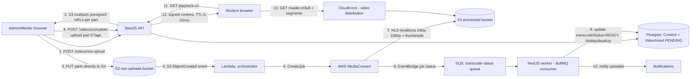

# 5. Video Platform & Content Protection

## 5.1 Upload → transcode → deliver pipeline

Steps in words:

1. **Init**: client asks the API for an upload; API creates the `Content`/`VideoAsset` row
   (`PENDING`) and returns S3 multipart presigned URLs (chunked to handle files up to 2GB
   reliably, resumable if a part fails).
2. **Direct-to-S3 upload**: the browser uploads parts directly to S3 (not proxied through the
   NestJS API), so a 2GB upload doesn't tie up an API instance or its memory/bandwidth.
3. **Completion**: client confirms all parts uploaded with their ETags; API completes the
   multipart upload server-side (`CompleteMultipartUpload`).
4. **Event-driven trigger**: S3 `ObjectCreated` fires a Lambda that creates a MediaConvert job —
   decoupled from the API process entirely, so transcoding survives API deploys/restarts.
5. **Transcode**: MediaConvert outputs an HLS adaptive-bitrate ladder (see §5.2) plus a thumbnail
   sprite, written to a separate **processed** bucket (raw uploads bucket has a lifecycle policy
   to delete/Glacier the source after N days once processed — raw masters are expensive to keep
   hot and aren't served directly).
6. **Status callback**: MediaConvert job state changes go through EventBridge → SQS; a BullMQ
   worker (long-running NestJS process, separate from the request-serving API) consumes and
   updates `VideoAsset.transcodeStatus`/`hlsManifestKey`, then fires a notification to the
   uploader ("Module 4 video is ready").
7. **Playback**: student requests a playback URL; API authorizes (enrolled? batch has this
   content assigned? release date passed?), issues short-TTL CloudFront signed cookies, and
   returns the manifest path. The browser then talks to CloudFront directly for the manifest and
   all segments — origin (S3) is never hit per-viewer at scale, CloudFront edge caching absorbs
   the read load.

## 5.2 Adaptive bitrate ladder

| Rendition | Resolution | Target bitrate | Use case |
|---|---|---|---|
| 240p | 426×240 | ~400 kbps | Poor connectivity fallback |
| 360p | 640×360 | ~800 kbps | Mobile data |
| 480p | 854×480 | ~1.4 Mbps | Standard mobile/tablet |
| 720p | 1280×720 | ~2.8 Mbps | Default broadband |
| 1080p | 1920×1080 | ~5 Mbps | High-speed connections |

HLS player (e.g. `hls.js` under a thin custom player, or Video.js) auto-switches renditions on
measured throughput. 1080p is the initial ceiling — 4K adds meaningfully to storage/transcode cost
for a training-content library where legibility of slides/terminal text matters more than pixel
density; revisit if course content specifically demands it (e.g. detailed UI walkthroughs).

## 5.3 AWS services used and why

| Service | Role |
|---|---|
| S3 (2 buckets: raw, processed) | Durable object storage; separate buckets for separate lifecycle/IAM policies |
| MediaConvert | Managed transcode to HLS ABR — no self-managed FFmpeg fleet |
| CloudFront | Edge delivery of HLS + signed URL/cookie support natively |
| Lambda | Event-driven glue (S3 event → MediaConvert job creation) — no idle compute cost |
| EventBridge + SQS | Reliable, decoupled job-status delivery into the app's worker |
| CloudWatch | MediaConvert job metrics/alarms (failed job rate, queue depth) |

## 5.4 Anti-piracy: signed delivery

- **CloudFront signed cookies** (not signed URLs) for video — cookies apply to every segment
  request under a manifest automatically, so we don't have to rewrite/sign every `.ts` segment
  URL individually. Scoped by `Path` (per-course or per-content prefix) and a short expiry
  (5–15 minutes), refreshed transparently by the player while the tab is open and the session
  remains valid.
- **No direct S3 access**: the processed bucket has no public access; CloudFront uses Origin
  Access Control (OAC) to be the only allowed reader.
- **No download affordance**: the player is HLS-only (segmented, not a single downloadable MP4);
  the UI never exposes a raw file link. This stops casual "save video as" but, per §5.6 below,
  does not stop screen recording.

## 5.5 Dynamic watermarking

- Client-side overlay rendered over the `<video>` element (DOM/canvas layer, not baked into the
  stream) showing: student name, student email, timestamp, and a session identifier — refreshed
  every N seconds and moved to a different corner/position periodically so it can't be reliably
  cropped out of a re-recording.
- Purpose: **deterrence + forensics**, not prevention. If a recording surfaces publicly, the
  watermark identifies which student's session produced it, which is what actually stops
  credential/content sharing in practice (people share less when it's traceable to them).
- **Honest limitation**: this is not server-side/forensic (baked-into-pixels) watermarking, which
  would require per-viewer video processing (expensive at scale, and still screen-recordable).
  Client-side DOM overlay is the pragmatic choice for launch; if piracy becomes measurably costly,
  the fast-follow is either (a) per-session forensic watermarking via a service like AWS Elemental
  MediaConvert's watermarking partners, or (b) full DRM (below).

## 5.6 Should we use real DRM (Widevine/FairPlay/PlayReady)?

**Not at launch.** Reasoning:

- DRM (via AWS Elemental MediaPackage + a DRM key provider, e.g. Irdeto/BuyDRM/Widevine) adds real
  cost (per-stream licensing fees) and integration complexity (license servers, player SDK
  support across browsers, key rotation).
- It meaningfully raises the bar against casual re-distribution of the *stream itself*, but — like
  watermarking — **does not stop screen recording**, which is the dominant real-world piracy
  vector for training content (a student can always point a phone at a screen). DRM's marginal
  benefit over signed HLS + watermarking + session/device controls is protecting against "someone
  extracts and re-hosts the raw stream," which is a real but lower-probability threat than casual
  screen capture for this content category.
- Recommendation: launch with signed HLS + watermarking + anomaly detection (this doc + doc 4),
  track actual leak incidents post-launch, and revisit DRM as a costed decision if/when piracy is
  observed to be a real, quantified problem rather than a hypothetical one.

## 5.7 DLP for PDFs/documents/resources

- Serve via an in-browser viewer (PDF.js-based) rather than a direct download link; the S3 object
  itself is never exposed as a public/downloadable URL, only fetched through a short-TTL signed
  URL from the API after authorization checks identical to video.
- **Per-student watermark stamped into the PDF** at request time (student email + timestamp
  overlaid using a PDF library, e.g. `pdf-lib`) — this one *is* baked into the file content
  (unlike video watermarking, PDFs are cheap to re-stamp per request), so if a downloaded/printed
  copy leaks, it's traceable.
- Viewer-level deterrents (disable right-click context menu, disable browser print shortcut
  interception) are included as low-cost friction but are explicitly **not** relied upon as a
  security boundary — any client-side JS restriction is trivially bypassable (browser dev tools,
  print-to-PDF, screenshot). The real control is the traceable watermark plus authorization/expiry
  on the signed URL.
- **Honest limitation, stated plainly**: once a PDF is rendered to a screen, a screenshot or photo
  defeats any DLP short of enterprise MDM/DRM the platform doesn't control on the student's device.
  Per-user watermarking is what makes that scenario traceable rather than "prevented" — this
  matches how comparable platforms (Coursera, Udemy Business) actually operate; there is no
  practical way to give a truly un-copyable rendering in a general-purpose browser.
