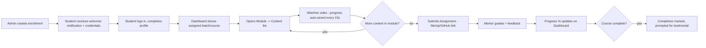
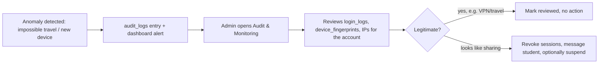

# 6. UI/UX Design

Design language: modern SaaS-learning aesthetic (Coursera/Udemy Business/Kajabi/Teachable
category) built on ShadCN + Tailwind, restyled with DigieKnowledge branding tokens (color/type
placeholders below — swap for actual brand palette when available).

## 6.1 Sitemap / Information architecture

```mermaid
flowchart TD
    ROOT[digieknowledge.com] --> MKT[Marketing site — existing Next.js landing page]
    ROOT --> LMS[lms.digieknowledge.com]

    LMS --> AUTH[/Login, MFA, Forgot Password/]
    LMS --> STU[Student Portal]
    LMS --> MEN[Mentor Portal]
    LMS --> ADM[Admin Portal]

    STU --> STU_DASH[Dashboard]
    STU --> STU_LEARN[My Courses -> Batch -> Module -> Content Player]
    STU --> STU_ASSIGN[Assignments]
    STU --> STU_PROFILE[Profile]
    STU --> STU_TESTI[Testimonials]
    STU --> STU_NOTIF[Notifications]

    MEN --> MEN_DASH[Batch Overview]
    MEN --> MEN_ROSTER[Student Roster]
    MEN --> MEN_CONTENT[Upload/Manage Content - own batches]
    MEN --> MEN_GRADE[Grade Submissions]
    MEN --> MEN_NOTIF[Notify My Batch]

    ADM --> ADM_DASH[Admin Dashboard]
    ADM --> ADM_STU[Student Management]
    ADM --> ADM_COURSE[Course Management]
    ADM --> ADM_BATCH[Batch Management]
    ADM --> ADM_CONTENT[Content Management]
    ADM --> ADM_MENTOR[Mentor Management]
    ADM --> ADM_NOTIF[Notifications - broadcast]
    ADM --> ADM_AUDIT[Audit & Monitoring]
    ADM --> ADM_SETTINGS[Settings - Super Admin only: roles, org config]
```



## 6.2 Navigation structure per role

- **Student**: left sidebar — Dashboard, My Learning, Assignments, Notifications, Profile,
  Testimonials. Top bar — search (within assigned content only), notification bell, avatar menu.
- **Mentor**: left sidebar — My Batches (switcher), Roster, Content, Grading Queue, Notifications.
  Scoped entirely to assigned batches; no global course/student browsing.
- **Admin/Super Admin**: left sidebar grouped by domain — Dashboard, Students, Courses, Batches,
  Content, Mentors, Notifications, Audit & Monitoring, and (Super Admin only) Settings/Roles.
  Top bar — global search across students/courses/batches, environment/impersonation banner when
  active.

## 6.3 Core user flows

### Student: enroll → learn → complete



### Admin: stand up a new course, no code changes

```mermaid
flowchart LR
    A[Create Category/Tags if new] --> B[Create Course - title, description, level]
    B --> C[Add Modules in order]
    C --> D[Upload Content per module - video/pdf/doc]
    D --> E[Create Batch - dates, capacity]
    E --> F[Assign Mentor to Batch]
    F --> G[Bulk-assign Students to Batch]
    G --> H[Assign/schedule Content release to Batch]
    H --> I[Batch goes ACTIVE, students see it on next login]
```



### Credential-sharing anomaly review (Admin)



## 6.4 Dashboard layout descriptions

### Student Dashboard

```
┌─────────────────────────────────────────────────────────────────┐
│ Welcome back, {name}             🔔 3    [Learning streak: 12🔥] │
├───────────────────────────────┬─────────────────────────────────┤
│ Enrolled Courses (cards)      │  Progress Ring: 62% complete     │
│  - Cyber Security Master      │  Videos completed: 24/38         │
│    Batch 4 · Mentor: J. Rao   │  Assignments submitted: 6/9      │
│    [Continue learning →]      │  Industry readiness score: 71    │
├───────────────────────────────┼─────────────────────────────────┤
│ Recent Activity (timeline)    │  Mentor card (photo, contact)    │
│  - Submitted Assignment 4     │  Fee status / next reminder      │
│  - Watched "IAM Basics"       │  Enrollment date                 │
└───────────────────────────────┴─────────────────────────────────┘
```

### Admin Dashboard

```
┌─────────────────────────────────────────────────────────────────┐
│ KPI row: Total Students | Active | Inactive | Courses | Batches │
├───────────────────────────────┬─────────────────────────────────┤
│ Course-wise enrollment (bar)  │ Batch-wise enrollment (table)    │
├───────────────────────────────┼─────────────────────────────────┤
│ Engagement metrics (trend)    │ Revenue metrics (placeholder,    │
│  DAU/WAU, completion rate     │  wired for future payments)      │
└───────────────────────────────┴─────────────────────────────────┘
```

Both dashboards use the same underlying stat-tile/chart primitives (see the `dataviz` design
system used for this project) so Admin and Student views feel like one product, not two.

## 6.5 Content player UX

- Fullscreen + Picture-in-Picture (native `<video>` PiP API), playback speed control (0.75x–2x),
  resume-from-last-position (reads `StudentProgress.lastPositionSeconds` on load), captions track
  slot reserved for future accessibility work, notes panel docked beside the player (persisted
  per student per content), resources/downloads-via-viewer tab alongside notes.

## 6.6 Branding note

Wireframes above use placeholder layout only — DigieKnowledge's actual color palette, logo, and
type scale (once provided) map onto Tailwind theme tokens and ShadCN's theming layer; no
layout rework needed when branding assets land.
