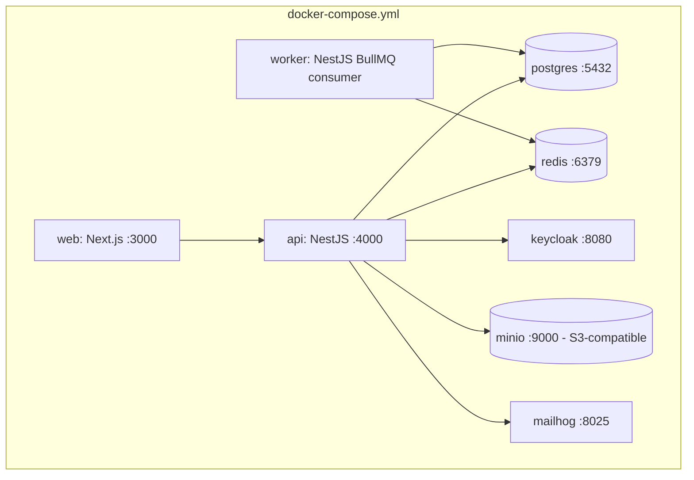
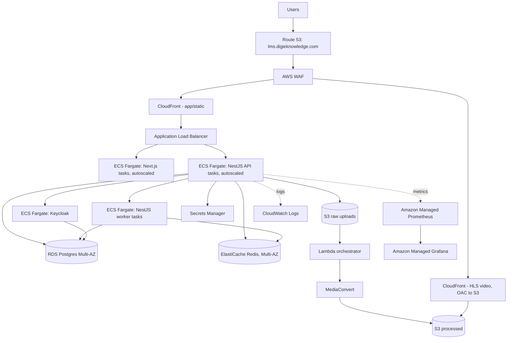
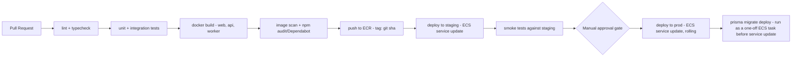

# 7. Deployment & Infrastructure

## 7.1 Environments

| Env | Purpose | Infra |
|---|---|---|
| Development | Local dev, feature branches | Docker Compose (all services local, MinIO for S3, no real Keycloak MFA required) |
| Staging | Pre-prod validation, PR preview for infra-affecting changes | Scaled-down mirror of prod (single AZ, smaller RDS instance class), real AWS services (S3/CloudFront/MediaConvert) so video pipeline is tested for real |
| Production | `lms.digieknowledge.com` | Full HA architecture below |

## 7.2 Local development: Docker Compose

Services: `postgres`, `redis`, `keycloak` (+ its own Postgres or shared instance with a separate
DB), `minio` (S3-compatible, for content/video buckets locally — MediaConvert itself isn't
practical to run locally, so local dev stubs transcoding: uploaded files are marked `READY`
immediately with a passthrough "transcoded" flag for UI development), `api` (NestJS, hot-reload),
`web` (Next.js, hot-reload), `mailhog` (catch outgoing notification emails), `worker` (BullMQ
consumer).

Local `.env` files are gitignored; `.env.example` documents required vars (`DATABASE_URL`,
`REDIS_URL`, `KEYCLOAK_*`, `S3_ENDPOINT` pointing at MinIO, `JWT_*`). Bootstrapping a fresh clone
is `docker compose up` + `prisma migrate dev` + `prisma db seed`.

## 7.3 Production AWS architecture

Notes:

- **ECS Fargate**, not EKS/self-managed EC2 — no cluster/node management overhead at this scale;
  revisit only if workload characteristics (e.g. GPU transcode workloads, which we don't need
  since MediaConvert is managed) demand it.
- **RDS Multi-AZ** from day one in prod (not an upgrade-later item) given the compliance/audit
  requirements — a primary-only DB losing an AZ is not acceptable for a system holding login/audit
  history.
- **Keycloak on ECS**, backed by RDS (separate schema/DB from the app), behind the same ALB on a
  distinct path/host so it can scale/patch independently of the API.
- **Prometheus/Grafana**: start with Amazon Managed Service for Prometheus + Amazon Managed
  Grafana to avoid operating the monitoring stack ourselves; self-hosted on ECS remains an option
  if managed pricing becomes a concern at scale.
- **Secrets Manager** for all credentials (DB, Keycloak client secrets, JWT signing keys); ECS task
  definitions reference secrets by ARN, never inline.

## 7.4 CI/CD (GitHub Actions)

- Separate workflow for infra changes (Terraform plan on PR, apply on merge to main with manual
  approval) — kept independent from the application deploy pipeline described above.
- Migrations run as a discrete pre-deploy ECS task (`prisma migrate deploy`), not embedded in
  container startup, so a migration failure blocks the deploy cleanly rather than crash-looping
  live tasks.
- Rolling deploy (ECS default) with health-check-gated task replacement; automatic rollback on
  failed health checks.

## 7.5 Backup & disaster recovery

| Asset | Backup mechanism | RPO target | RTO target |
|---|---|---|---|
| RDS Postgres | Automated daily snapshots + continuous PITR (35-day window) | < 5 min (PITR) | < 1 hr (restore to new instance) |
| S3 (raw + processed) | Versioning enabled; cross-region replication to a secondary region for processed bucket (the irreplaceable, expensive-to-regenerate asset) | Near-zero (S3 durability) | Minutes (already in place via CRR) |
| Redis | Treated as ephemeral (cache/session/queue) — not backed up; on loss, sessions re-auth and in-flight jobs are re-enqueued from durable job records in Postgres | N/A | Minutes (respin ElastiCache) |
| Keycloak realm config | Exported to version control (realm JSON) after any config change, in addition to its DB being covered by RDS backup | < 1 day | < 1 hr |
| Infra (Terraform state) | Remote state in S3 with versioning + DynamoDB state lock | N/A | Re-apply from source |

**DR drill cadence**: quarterly restore-from-snapshot test into a scratch environment to verify
backups are actually restorable, not just "backups exist" — this is the step teams skip and
regret.
